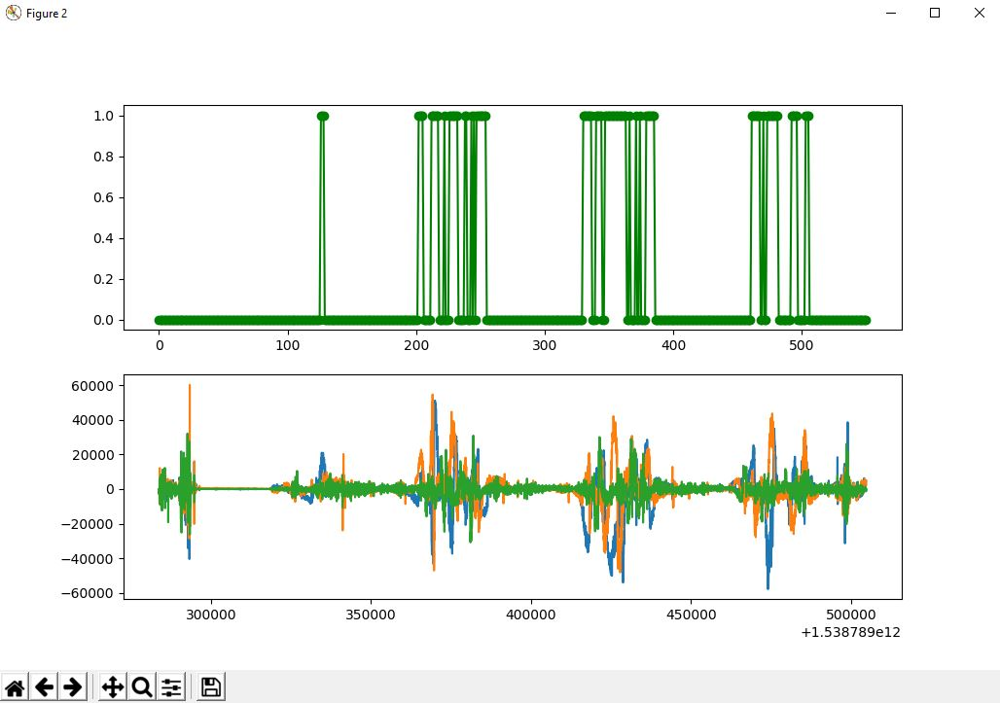

# ParkHeroRideRec

Part of the [Park Hero Project](https://github.com/Jester565/ParkHeroReactNative)

Creates fingerprints of a roller coaster's acceleration.  The fingerprint will recognize at what point of the ride the user is on.  In the [ParkHero app](https://github.com/Jester565/ParkHeroReactNative), this information is used to automatically generate a video:

[](https://www.youtube.com/watch?v=1GXFSrb2WSc)

## Getting Started

The project requires Python3.
```bash
python3 -m venv ./venv
./venv/Scripts/activate
pip3 install -r requirements.txt
```

You will also need files containting the [AccelerationData protobuf message](./Accel.proto) (I've provided some).

## Processing Acceleration

Acceleration is... messy.  Especially when it comes from an accelerometer on a phone.  Therefore, we have to convert the raw acceleration into a simpler format that filters out all the jittery inaccuracies that come with the bumps of the roller coaster before we fingerprint or recognize our data.


## The Fingerprint

Fingerprinting is the process of converting data into something we can easily compare new data to.  Let's create a fingerprint for Thunder Mountain so we can try to recognize it later.

```
python ./RideRec.py
>>> Enter mode (fingerprint: f, recognize: r)
        f
>>> Enter accelFile:
        ./data/bigthunder
```

A graph of the raw acceleration and the processed acceleration will then be shown:




While processed acceleration can be used as a fingerprint, key sections of the ride should be highlighted and labelled to ensure the best results.  Key sections should contain parts of the ride with substantial acceleration.  For example, Thunder Mountain should have a key section for each drop and exclude cranks.  Furthermore, labels can be used to tell our auto-editting code what part of the ride we're on.  To create a key section (called a RecSection), simply click and drag over the portion of the graph you want to add.


After, the console will prompt you for a label for the section.

```
>>> Enter RideSection Name:
        drop1
```

Continue creating RecSections by highlighting and labelling.  After you're done, close all graph windows and you will be prompted for a pack name.

```
>>> Enter pack name:
        thunder_mountain
```

## Recognition

We want to compare our new data to our fingerprints and identify the closest match and when the match occured.

```
python ./RideRec.py
>>> Enter mode (fingerprint: f, recognize: r)
        r
>>> Enter accelFile:
        ./data/bigthunderagain
```

Graphs will be shown, <b>highlight the entire ride's acceleration</b> to try to recognize it.


If done correctly, you should see this output in your console:
```
REC:  thunder_mountain  --  30  --  [196, 323, 453]
```

30 is the distance and 196, 323, & 453 are the indices that RecSections matched.

## Generating Video

This project doesn't generate the RideRecognition video anymore.  Instead, its handled locally [here](https://github.com/Jester565/ParkHeroReactNative/blob/master/android/app/src/main/java/com/parkhero/RideRecService.kt).  This code needs the generated `packs` file so it can edit using your labels:

```json
[
    {
        "file": "t1.mp4",
        "position": 0
    },
    {
        "accel": "drop1",
        "start": 2000,
        "duration": 5033,
        "position": 1,
        "dbOff": -10
    },
    ...
]
```